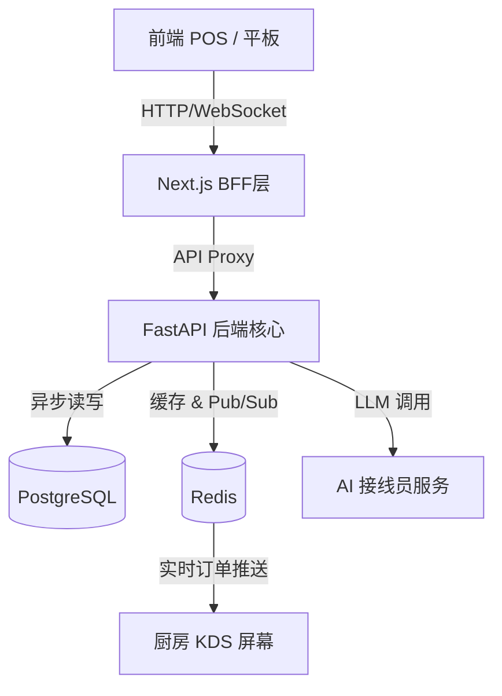

# Synapse OS 技术架构升级改造方案 (Migration Plan)

## 🎯 目标 (Objective)

将 Synapse OS 从目前的"前端演示版 (Frontend Demo)"升级为具备高并发、实时交互及 AI 能力的**商业级 SaaS 系统**。

**目标技术栈**:
- **前端**: Next.js (React) + Tailwind CSS
- **后端**: FastAPI (Python)
- **数据库**: PostgreSQL (主库) + Redis (缓存/消息队列)
- **部署**: Docker / Kubernetes

---

## 🏗️ 目标架构图 (Target Architecture)

---

## 📅 改造阶段 (Phases)

### 第一阶段：后端基础设施搭建 (Backend Infracstructure)
**目标**: 建立数据持久化与核心 API 服务。

1.  **环境准备**
    - 初始化 FastAPI 项目结构 (`app/main.py`, `app/api`, `app/core`).
    - 配置 Docker Compose: 包含 `web`, `db` (PostgreSQL), `redis` 服务。
    - 配置 Poetry 或 requirements.txt 管理 Python 依赖。

2.  **数据库设计 (PostgreSQL)**
    - 设计核心表结构: `users`, `tables`, `menu_items`, `orders`, `order_items`.
    - 使用 SQLAlchemy 或 Tortoise ORM 进行模型定义。
    - 实现 Alembic 数据库迁移脚本。

3.  **API 开发 (FastAPI)**
    - 迁移现有 Mock 数据逻辑到后端 API:
        - `GET /api/v1/menu`
        - `GET /api/v1/tables`
        - `POST /api/v1/orders`
    - 实现 JWT 认证中间件。

### 第二阶段：前端迁移与重构 (Frontend Migration)
**目标**: 从 Vite 迁移至 Next.js，引入 Tailwind CSS。

1.  **项目初始化**
    - 使用 `create-next-app` 初始化新项目。
    - 配置 Tailwind CSS (可参考 FlymeOS 风格定制 `tailwind.config.js`).

2.  **组件迁移**
    - 将现有 `src/components` 下的 React 组件迁移至 Next.js。
    - **样式重构**: 将 CSS Modules/原生 CSS 逐步替换为 Tailwind Utility Classes。
      - *例*: `.btn-primary` -> `bg-blue-500 hover:bg-blue-600 text-white rounded-xl`.
    - 配置 Next.js API Routes 作为 BFF 层（可选，或直接请求 FastAPI）。

3.  **状态管理改造**
    - 废弃纯本地 Mock State。
    - 引入 `React Query` (TanStack Query) 或 `SWR` 进行服务器状态管理与缓存。

### 第三阶段：实时能力构建 (Real-time Features)
**目标**: 实现 KDS 秒级订单同步。

1.  **KDS 改造**
    - 后端: 在“创建订单”接口中，写入 DB 后不仅返回成功，同时向 Redis Channel (`orders:new`) 发布消息。
    - 后端: 实现 WebSocket Endpoint (`/ws/kds`)，订阅 Redis Channel 并推送到前端。
    - 前端: KDS 页面建立 WebSocket 连接，接收实时订单数据，无需手动刷新。

### 第四阶段：AI 与高级功能 (AI & Advanced)
**目标**: 启用 AI 接线员。

1.  **AI 服务集成**
    - 利用 FastAPI 的异步特性，集成 OpenAI/LangChain SDK。
    - 实现 `/api/v1/ai/chat` 接口，处理语音转文字(STT)与自然语言理解(NLU)。

---

## 🛠️ 程序员执行检查清单 (Checklist for SDE)

### 1. 数据库层
- [ ] PostgreSQL 容器已通过 Docker 启动，端口 5432。
- [ ] Redis 容器已启动，端口 6379。
- [ ] Schema 设计完成 (ER图已确认)。

### 2. 后端层 (FastAPI)
- [ ] 实现 Pydantic Models (数据校验)。
- [ ] 实现 Async PG Driver (推荐 `asyncpg`).
- [ ] 编写 Pytest 单元测试覆盖核心订单逻辑。

### 3. 前端层 (Next.js + Tailwind)
- [ ] 配置好 `flyme` 主题色到 `tailwind.config.js`。
- [ ] 确保 Next.js 中 `Image` 组件正确使用（性能优化）。
- [ ] 替换原有的路由逻辑 (`react-router-dom` -> `next/navigation`).

### 4. 部署 (DevOps)
- [ ] 编写 `Dockerfile` (前端构建 + 后端构建)。
- [ ] 编写 `docker-compose.yml` 一键启动完整环境。

---

> **注意**: 迁移过程中应采取"绞杀植物模式 (Strangler Fig Pattern)"，即先保持现有前端可用，逐步替换后端接口，最后彻底切换前端框架，降低风险。
